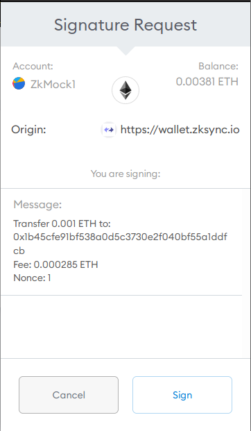

# ZkSync

## 简介

ZkSync是由matter-labs开发的，专注以太坊L2扩容的隐私引擎。ZkSync的核心是PLONK零知识证明算法，matter-labs团队在bellman库上实现了PLONK。

matter-labs的bellman改造库叫bellman_ce。另外filecoin团队也对bellman优化支持GPU运算，叫bellperson。

ZKrollup 保证：
1. Rollup 验证人没法修改状态或盗取资金。
2. 即使Rollup服务停止了，用户也可以取回资金。
3. 由于有了有效性证明，无论是用户还是单独的其他可信方，都不需要在线监控Rollup块以防止欺诈


## Demo运行
在ubuntu 20.4
> The following guides for developers are available:
Installing development dependencies: docs/setup-dev.md.
Launching zkSync locally: docs/launch.md.
Development guide: docs/development.md.
Repository architecture overview: docs/architecture.md.

1. 拉取：https://github.com/matter-labs/zksync.git

2. 设置环境变量

```shell
export ZKSYNC_HOME=/path/to/zksync
export PATH=$ZKSYNC_HOME/bin:$PATH
```

3. 编译Rust代码：

按照Zksync setup-dev文档设置编译环境，拉取代码，编译成功。
核心的几个二进制文件：

```text
    "core/bin/data_restore",
    "core/bin/key_generator",
    "core/bin/server",
    "core/bin/prover",
    "core/bin/parse_pub_data",

    # Server micro-services
    "core/bin/zksync_api",
    "core/bin/zksync_core",
    "core/bin/zksync_eth_sender",
    "core/bin/zksync_witness_generator",
```

4. 配置初始化

`zk init`

有意思的是，通常我们使用shell来写一些常规的执行脚本，而这使用了ts，核心是commander库，可支持异步执行，效果还不错。 个人见解，使用ts编写后期可便于写集成测试。 这里的zk命令是在环境路径中已经配置了，因此能执行。

5. 运行

启动 docker。

```shell
zk up
zk server  // 源码 zksync_server
zk dummy-prover //  源码zksync_prover
```

几个服务端口：

```shell
8545和8546： geth端口，以太坊仿真。
5432： postgres数据库。
9975： 代币流动性检查工具。
9876：费用报价服务。
8000：开发版浏览器端口。
8088：证明服务端口。
3030：ZkServer的 http json rpc端口。
3031：ZkServer的ws 端口。
```

6. 本地压力测试

```shell
zk run loadtest
```

## 代码分析
工程架构查看 [文档](https://github.com/matter-labs/zksync/blob/master/docs/architecture.md)。里面从高维度和低维度两个方向介绍工程，这个说明方式不错。低纬度介绍具体每个目录，高维度介绍整个Zksync由那几部组成，配个图:


> EthWatch负责从以太坊上获取合约的操作信息，并解析状态。BlockProposer负责从Mempool获取数据并组成ProposalBlock。StateKeeper负责打包和执行区块，账户状态记录。Committer负责将确定的区块，状态等数据持久化。MemPool负责记录最新的交易和状态，部分数据持久化。

每个目录介绍看文档。

bin - 启动脚本
contracts - L1智能合约逻辑
core - L2的核心逻辑
docker - docker相关的配置
docs - 文档，比较详细的解释了zkSync的协议设计，电路实现，智能合约，K8如何配置，以及如何启动等等。
etc - 配置信息
infrastructure - 一些辅助工具。
sdk - 多语言客户端库


### Core代码分析

bin/server - 服务总入口，运行监控数据、核心任务、API服务、以太坊发送服务、证明生成服务、
bin/prover - 零知识证明的证明生成引擎

bin/data_restore - 状态恢复的相关逻辑
bin/key_generator - eth客户端的封装
bin/parse_pub_data - 解析Pubdata数据。
bin/zksync_* - ZkSync微服务

@lib/circuit - 零知识证明电路实现
@lib/crypto - 零知识证明底层库封装
@lib/storage - 所有状态的存储以及持久化逻辑
lib/api_client - Rest接口封装
lib/basic_types - 对基础类型封装，与web3类型统一
lib/config - ZkSync配置信息 envy库
lib/contracts - 使用ethabi对于合约实例化
lib/eth_client - 对ETH接口封装，支持测试，直接模式，多播模式
lib/eth_signer - ETH签名抽象，支持客户端签名和私钥签名
lib/prometheus_exporter - 数据统计服务
lib/prover_utils -  证明系统的辅助工具
@lib/state - ZkSync的状态系统
@lib/types - ZkSync中必要的类型，交易，操作
test/loadtest - 压力测试相关逻辑
....等

#### 数据类型

对types库为什么没有用现有序列化与反序列化，而使用自定义的。这明显增加了工作量。 最底层使用了稀疏默克尔树，

交易分为两种两种：L1交易和L2交易。Block Proposer将交易打包，并更改世界状态(Plasma State)。在世界状态更改后，通过Block Committer生成证明需要的信息。零知识的证明通过Plonk证明系统生成，其中包括Prover Server和Proving Client。API提供接口实现UI的信息展示和L2的交易提交。


交易有修改公钥，移除账户，强行退出（当L1不可用），转账，赎回类型。

#### L2账户系统和世界状态
zkSync并不需要独立生成新账户。zkSync的L2账户和L1账户一一对应，“共享”一份私钥。

简单的说，L1的私钥的ECDSA签名的结果作为L2账户的私钥。L2账户的秘钥是JubJub曲线上的Scalar值，对应的公钥是对应椭圆曲线上的点。L2的状态包括两部分：账户以及账户下所有Token的余额。


### Contracts代码分析

TODO

## 工具分析

浏览器：https://zkscan.io/


与现有大多数区块链浏览器的功能一致， 差别是复制L2的数据统计。

钱包：https://wallet.zksync.io/


网页版钱包，支持原生币和代币的转入和转出，以及在L2上的转账操作。

## ZkSync使用

合约地址：
0xabea9132b05a70803a4e85094fd0e1800777fbef


#### 转入操作：

交易是在L1上发起的。

在ethescan区块链浏览器上可找到交易内容。


#### 接着激活账户:


Metamask的信息


感觉又被坑了一笔钱。

#### 转账操作：

给其他账户转账会有提示。


Metamask签名提示



#### 赎回操作：

交易是在L2上发起的，如果L2服务挂了，那要如何处理？


成功界面。
赎回费用要0.00788。手续费要0.000286。

### 外部转账与内部转账的手续费差异。


**手续费0.00231**


**手续费0.000285**


感想。与中心化交易所相比，还有操作手续费，这就没有优势了。
如果在L2实现AMM，那么赎回时间上又没法实时到账，与L1的AMM体验相比，就比较差了。