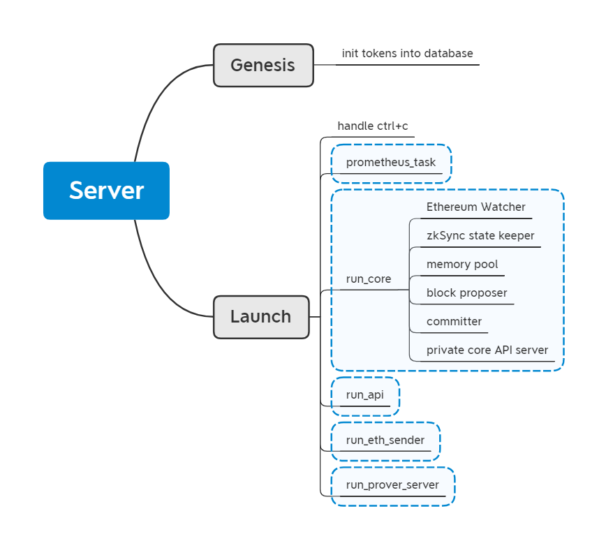

## 运行三要素
1. smart contract已经部署到Ethereum中。
2. zkSync服务器已经启动。
3. 至少启动一个prover并连接到服务器。

## server程序结构

在server中，zksync_api, zksync_core, zksync_eth_sender, zksync_witness_generator可以单独运行在不同的服务器上，形成微服务群。
值得注意的是：zksync_prometheus_exporter是不能单独运行的，目前集成在server中，所以如果要分开运行各模块，那么就没有了prometheus服务。

## 使用体验
使用的时候需要先从L1中转钱才能使用。整体感觉类似于跨链操作。只是有了zkp之后能够保证更好的安全性。

## 疑惑与不足
Server似乎只有一个。如果挂了那该怎么处理？感觉这样又回到了中心化的依赖模式。
如果没有prover参加会导致无法产生proof，而且产生proof对硬件要求比较高，在数据量大的时候对prover的质量或者说数量的要求也比较高。