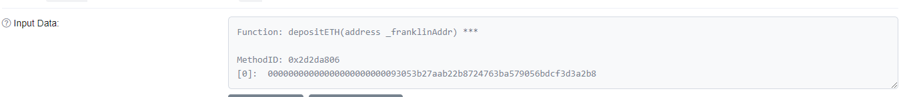
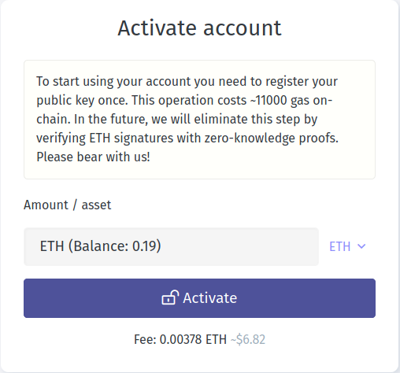
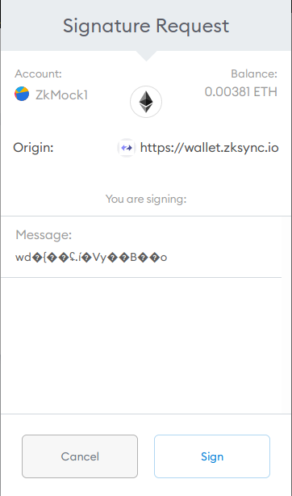
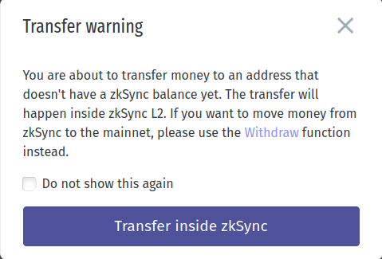
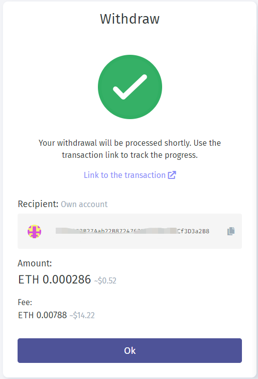
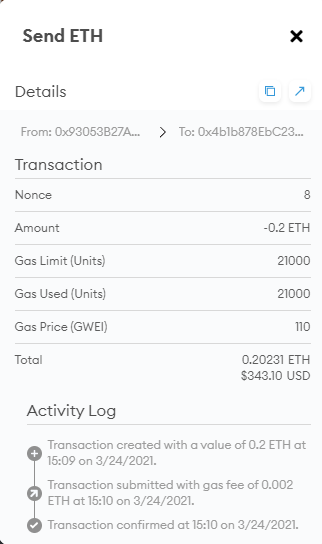
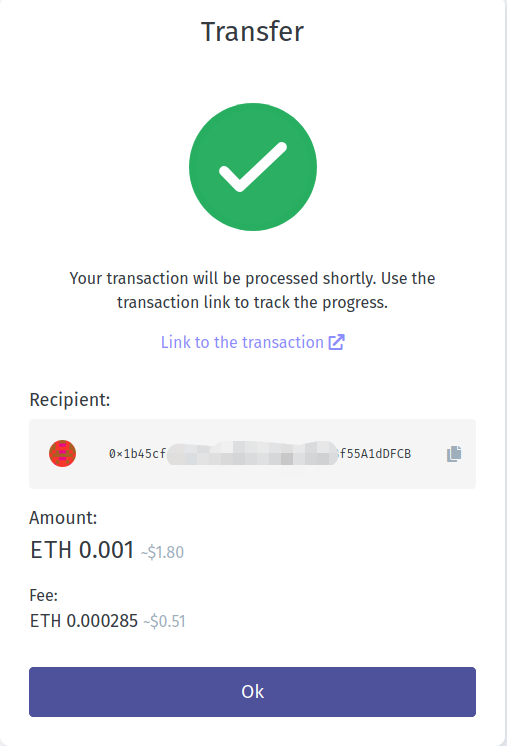

# Wallet

## ZkSync使用

合约地址：
0xabea9132b05a70803a4e85094fd0e1800777fbef

#### 转入操作：

交易是在L1上发起的。

在ethescan区块链浏览器上可找到交易内容。

#### 接着激活账户:

Metamask的信息

感觉又被坑了一笔钱。

#### 转账操作：

给其他账户转账会有提示。

Metamask签名提示

#### 赎回操作：

交易是在L2上发起的，如果L2服务挂了，那要如何处理？

成功界面。
赎回费用要0.00788。手续费要0.000286。

### 外部转账与内部转账的手续费差异。

**手续费0.00231**

**手续费0.000285**

感想。与中心化交易所相比，还有操作手续费，这就没有优势了。
如果在L2实现AMM，那么赎回时间上又没法实时到账，与L1的AMM体验相比，就比较差了。