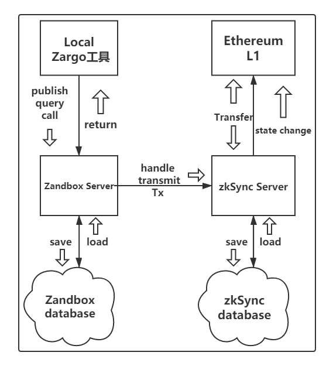

# 整体工作流程分析

* zargo编译合约或者library，将其发送到zandbox中，也可以调用特定合约方法创建tx，然后通过http发送到zandbox中。
* contract和library存储在zandbox的database中。
* zandbox负责接受zargo的请求，处理请求，修改contract状态，转发tx到zkSync，返回结果。
* 后续zkSync的处理以及存储有待补充。

## Zargo
zargo是一个本地工具，负责的功能有：

    1. build: 编译contracy、library。
    2. publish: 合约或者library到zandbox上。
    3. query: 调用方法查询特定合约参数或者查询整个合约。
    4. call: 调用合约方法(涉及到改变状态的函数都需要call来调用)。
    5. run: 本地用VM跑一个方法。
    6. upload: 上传contract或者library到zandbox。
    6. init: 主动初始化刚上传的合约。
    7. 其它功能暂时不计，具体可以看文档。
    
## zandbox
zandbox是一个存储合约并转发tx的服务器。

    1. call: 对特定合约调用特定方法，此举会改变合约的存储状态，并转发zargo发来的tx到zkSync中。
    2. fee: 计算需要的基础费用并返回给zargo。
    3. initialize: 对应zargo的init，初始化刚创建的合约。包括chuange_pubkey任务和基本的deposit
    4. publish: 对应zargo的publish，完成对应的功能。
    5. query: 查询对应合约的storage，可以指定方法查询特定值，或者直接查询整个合约状态。